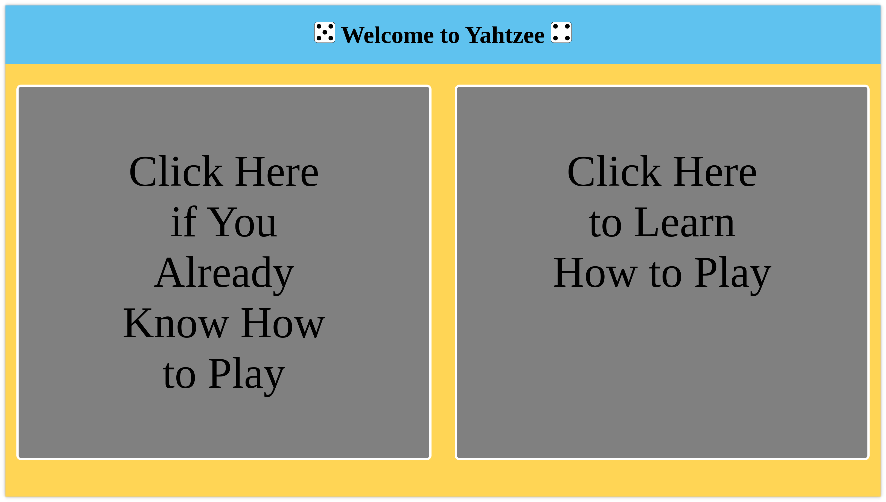

## About

This is a simple yahtzee game I wrote in the Summer of 2019 when I was learning Web Development and Javascript. As it was a learning exercise, it is not particularly polished, and you may encounter some janky CSS.

## Setup

Clone the repository:

```
git clone https://github.com/lshprung/yahtzee-js.git
```

Navigate to the directory the repo was cloned into and start a localhost PHP server. I use port 8000 in this example:

```
php -S localhost:8000
```

Now open a web browser and enter the following URL: `http://localhost:8000/yahtzee.html`. If everything went right, you should see the following:


